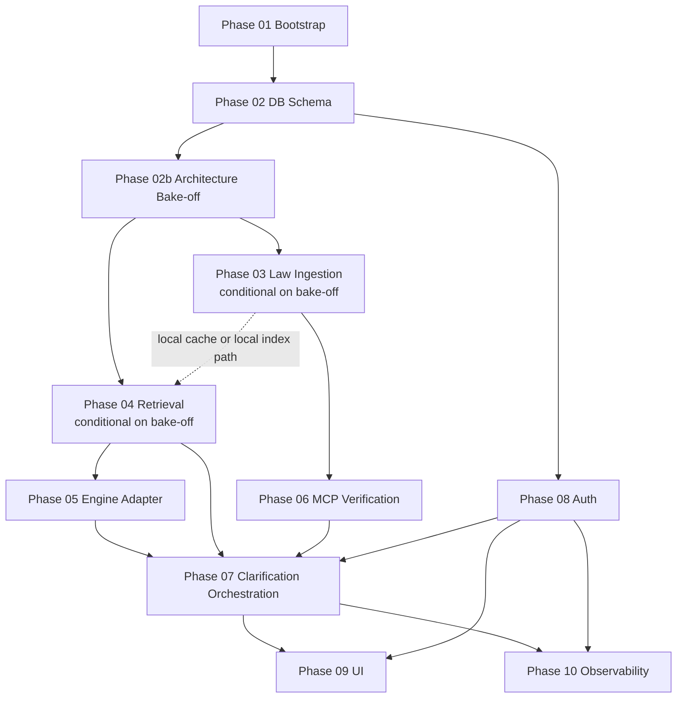

<!-- /autoplan restore point: /Users/user/.gstack/projects/8-legal-compliance-assistant/main-autoplan-restore-20260415-211543.md -->
# Legal Compliance Assistant Plan

Goal: build an authenticated legal compliance assistant that indexes a focused cluster of Korean industrial-safety law (산업안전보건법, 중대재해처벌법, 도급·관계법령 부속 조항) from `open.law.go.kr`, produces an expert-ready compliance triage packet (facts, citations, missing facts, recommended next owner, escalation path) for each question, handles an explicit reference date, verifies cited law at runtime via `korean-law-mcp`, and refuses to answer without evidence.

Architecture summary:
- Next.js App Router provides authenticated server routes and a mobile-first intake surface, with desktop as the review/export surface; both remain responsive.
- PostgreSQL stores users, auth sessions, law content or caches selected by the bake-off, question history, feedback, and service-update metadata.
- Retrieval strategy is not precommitted: Phase 02b compares MCP-only, targeted cache plus live MCP verification, and full pgvector local index before Phases 03 and 04 lock their implementation.
- Answer generation is adapter-first: all model calls go through `src/lib/assistant/engine/`, with Anthropic Messages API as the MVP backend and the Codex daemon kept only as a parallel stub and future swap target.
- Primary artifact is the triage packet, which bundles answer + evidence + gaps + escalation; answer generation is one component, not the whole product.
- Every answer is verified at render time against `korean-law-mcp`; disagreement favors the live verification path, not the local cache.

Data sources summary:
- Bulk ingestion or targeted caching is limited in MVP to this law cluster: `산업안전보건법`, `산업안전보건법 시행령`, `산업안전보건법 시행규칙`, `산업안전보건기준에 관한 규칙`, `중대재해 처벌 등에 관한 법률`, `중대재해 처벌 등에 관한 법률 시행령`, plus their attached tables, appendices, and 도급·관계수급인 관련 조항 from `open.law.go.kr`.
- Runtime verification uses `korean-law-mcp` for answer-time citation checks and on-demand fallback lookup.
- History policy: stored answer snapshots remain immutable for reopen; current-law reruns are separate records.

AI engine summary:
- Canonical interface: `generate({ sessionId?, prompt, schema }) -> { sessionId, response }`, where `sessionId` is a server-owned opaque handle rather than a client-visible provider token.
- MVP backend: Anthropic Messages API behind the existing `EngineAdapter`.
- Parallel stub: `codex mcp-server` remains adapter-compatible for experiments and future swap evaluation, but is not the MVP load-bearing path.
- Safety contract: schema validation retries once, then returns `schema_error`; no free-text fallback.
- Session continuity: engine conversation context is carried by a provider-native identifier when available, otherwise by server-managed conversation state.

Tech stack summary:
- Next.js 15, React 19, TypeScript, PostgreSQL 16, optional `pgvector`/HNSW only if Phase 02b selects a local-index path, `postgres`, `pino`
- `fast-xml-parser` for law XML parsing and targeted cache ingestion from `open.law.go.kr`
- `@xenova/transformers` with `intfloat/multilingual-e5-base` for embeddings if the Phase 02b bake-off selects a local-index path
- Vitest and Playwright for tests
- Email magic-link for internal trial; Google OAuth added before external pilot; SSO before paid
- Vercel runtime pin: the ask and verification routes run on the Node.js runtime with an explicit function-timeout budget; MCP verification and rerun flows must reconcile their internal deadline to finish or downgrade before that platform timeout expires.

## MVP Corpus Scope

In scope for MVP:
- `산업안전보건법`
- `산업안전보건법 시행령`
- `산업안전보건법 시행규칙`
- `산업안전보건기준에 관한 규칙`
- `중대재해 처벌 등에 관한 법률`
- `중대재해 처벌 등에 관한 법률 시행령`
- The attached 별표, 별지, appendices, and 도급·관계수급인-related provisions within the laws above

Deferred to post-MVP:
- Broader labor law such as `근로기준법`, `파견근로자보호 등에 관한 법률`, and other non-safety employment statutes
- Chemical, environmental, construction, fire, dangerous-goods, civil, commercial, and tax law coverage
- Nationwide "all Korean law" retrieval claims

Reference docs:
- Historical source plan: [2026-04-11-legal-compliance-assistant.md](/Users/user/Documents/project/8-legal-compliance-assistant/2026-04-11-legal-compliance-assistant.md)
- Design doc: [2026-04-11-legal-compliance-assistant-design.md](/Users/user/Documents/project/8-legal-compliance-assistant/2026-04-11-legal-compliance-assistant-design.md)
- Non-negotiable rules: [INVARIANTS.md](/Users/user/Documents/project/8-legal-compliance-assistant/INVARIANTS.md)
- Shared interfaces and envelopes: [CONTRACTS.md](/Users/user/Documents/project/8-legal-compliance-assistant/CONTRACTS.md)

## Dependency Graph

## Phase Summary

| Phase | File | Scope |
| --- | --- | --- |
| 01 | [plans/phase-01-bootstrap.md](/Users/user/Documents/project/8-legal-compliance-assistant/plans/phase-01-bootstrap.md) | Create the Next.js skeleton, env parsing, runtime pinning, and test harness baseline. |
| 02 | [plans/phase-02-db-schema.md](/Users/user/Documents/project/8-legal-compliance-assistant/plans/phase-02-db-schema.md) | Define PostgreSQL base schema, conditional vector migrations, and core persistence contracts. |
| 02b | [plans/phase-02b-architecture-bakeoff.md](/Users/user/Documents/project/8-legal-compliance-assistant/plans/phase-02b-architecture-bakeoff.md) | Run the retrieval architecture spike and choose MCP-only, targeted cache, or full local index before P3 and P4 commit. |
| 03 | [plans/phase-03-law-ingestion.md](/Users/user/Documents/project/8-legal-compliance-assistant/plans/phase-03-law-ingestion.md) | Build only the MVP 산안법/중처법/도급 cluster corpus or cache path selected by the bake-off. |
| 04 | [plans/phase-04-retrieval.md](/Users/user/Documents/project/8-legal-compliance-assistant/plans/phase-04-retrieval.md) | Implement the bake-off-selected retrieval path and evaluate it only on the MVP wedge. |
| 05 | [plans/phase-05-engine-adapter.md](/Users/user/Documents/project/8-legal-compliance-assistant/plans/phase-05-engine-adapter.md) | Add the provider-agnostic engine adapter, Anthropic client, Codex stub, and schema retry logic. |
| 06 | [plans/phase-06-mcp-verification.md](/Users/user/Documents/project/8-legal-compliance-assistant/plans/phase-06-mcp-verification.md) | Verify citations against `korean-law-mcp`, handle disagreement, and mark stale local data. |
| 07 | [plans/phase-07-clarification-orchestration.md](/Users/user/Documents/project/8-legal-compliance-assistant/plans/phase-07-clarification-orchestration.md) | Wire reference-date checks, retrieval, clarification, answer generation, verification, persistence, reruns, and the lawyer-graded correctness gate. |
| 08 | [plans/phase-08-auth.md](/Users/user/Documents/project/8-legal-compliance-assistant/plans/phase-08-auth.md) | Add internal-trial auth and durable user identity continuity, with pilot-readiness requirements for stronger enterprise auth. |
| 09 | [plans/phase-09-ui.md](/Users/user/Documents/project/8-legal-compliance-assistant/plans/phase-09-ui.md) | Build the mobile-first intake and desktop review/export UI around the triage packet, expert review requests, onboarding, and recovery states. |
| 10 | [plans/phase-10-observability.md](/Users/user/Documents/project/8-legal-compliance-assistant/plans/phase-10-observability.md) | Add structured logging, metrics, rate limiting, behavior-version tracking, and steady-state eval coverage. |

## Phase Notes

- Phase numbering is stable for review and tracking; it is not the same thing as the only safe execution order.
- Auth is Phase 08 because it is a distinct subsystem, but it must land before real-user rollout and before any anonymous history behavior could exist.
- Phase 02b is a mandatory spike, not optional discovery work; Phases 03 and 04 must conform to its decision document.
- The orchestration phase depends on retrieval, engine, verification, and auth, so it is the integration pivot.

## Stage Gates

- Gate 1: 50 real questions asked by real users from the MVP wedge within the first month of internal trial.
- Gate 2: measurable reduction in time-to-escalation or time-to-first-answer versus the current workflow.
- Gate 3: at least one team uses the product weekly for four consecutive weeks.
- If Gate 1 or Gate 2 fails: kill nationwide expansion and pivot to the packet/escalation workflow as the primary product.

## Self-Check Before Execution

- Verify every item in [INVARIANTS.md](/Users/user/Documents/project/8-legal-compliance-assistant/INVARIANTS.md) is traceable to at least one phase.
- Verify every interface or envelope consumed across phases exists in [CONTRACTS.md](/Users/user/Documents/project/8-legal-compliance-assistant/CONTRACTS.md).
- Verify Phase 02b produces `docs/architecture-bakeoff.md` before Phases 03 and 04 are treated as committed.
- Verify no phase file inlines full config files, migrations, React component bodies, or long test fixtures.
- Verify answer-time behavior still enforces explicit reference-date handling, empty-evidence refusal, schema retry limits, runtime verification downgrade, and auth scoping.
- Verify the design constraints in the linked design doc are reflected in the mobile intake flow, desktop review/export flow, orchestration, and retrieval phases.

## Suggested Execution Order

1. Phase 01 Bootstrap
2. Phase 02 DB Schema
3. Phase 02b Architecture Bake-off
4. Phase 03 Law Ingestion
5. Phase 04 Retrieval
6. Phase 05 Engine Adapter
7. Phase 06 MCP Verification
8. Phase 08 Auth
9. Phase 07 Clarification Orchestration
10. Phase 09 UI
11. Phase 10 Observability

Rationale:
- Phase 02b de-risks the retrieval architecture before the team pays local-index complexity or hardens an MCP-only path.
- Phases 03 through 06 create the wedge corpus or cache path, retrieval, generation, and verification spine for the triage packet.
- Phase 08 must exist before the integrated API and UI are treated as production-like.
- Phase 10 comes last because it should observe the integrated system, not an isolated fragment.

## Intentionally Dropped From Original Plan

- Inline full-file source listings for config files, components, SQL migrations, scripts, and tests.
- Long code blocks that belonged to implementation rather than planning.
- Repetition between the original file-structure section and task steps when the same intent is now captured once in [CONTRACTS.md](/Users/user/Documents/project/8-legal-compliance-assistant/CONTRACTS.md) and the phase plans.
- The assumption that a Codex daemon, nationwide corpus, and desktop-first UI are all MVP commitments.

Reasoning:
- The revised plan is meant to describe what must be built and why, while preserving the interfaces, invariants, and acceptance criteria needed to execute it safely.
